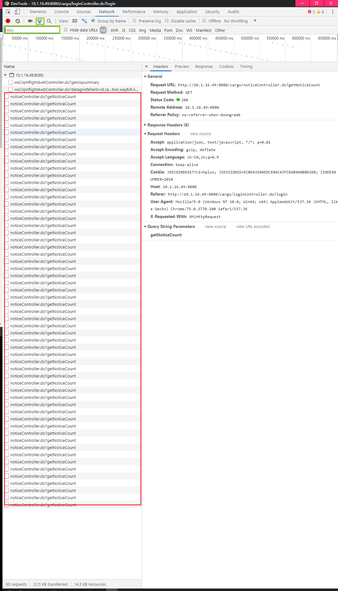

# 控制台 NetWork 过滤无用请求

---



Chrome 控制台支持过滤参数，可以过滤掉无用请求，过滤框支持简单的正则表达式，但是如果想要过滤无用的请求，就需要 Chrome 控制台支持了，具体规则如下：

- `//` 圈起来正则表达可以将网络请求按照正则规则进行匹配，过滤无用请求
- `-//` 圈起来的正则表达是也可使匹配网络请求，但由于前面加了 `-`，就相当于 `非`，可以过滤掉匹配的请求

使用示例：

```
-/.*.js|.*.css/
```

使用场景：一般工作中，Web 页面有很多无用的定时请求，污染 Network 列表，可以使用这个规则，过滤掉所有的定时请求，安心的观察有用的请求。