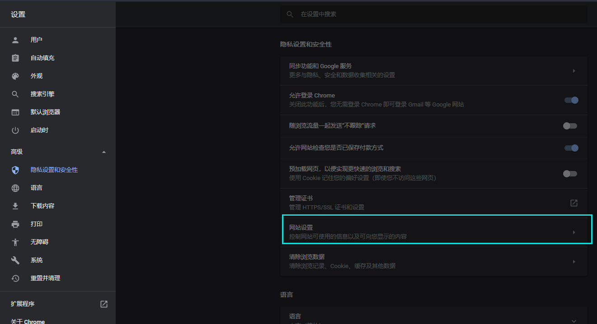
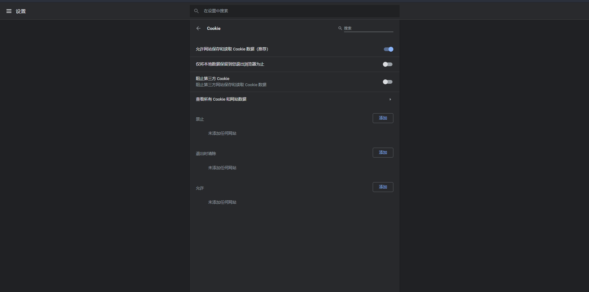
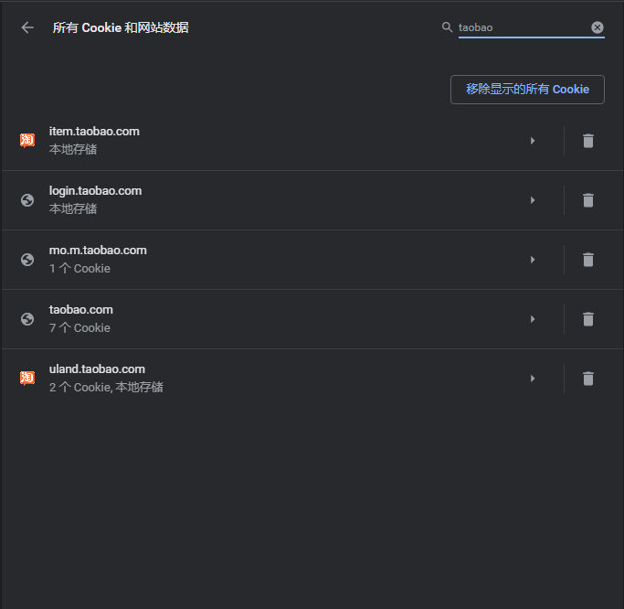

# Chrome浏览器查看Cookie

1. 进入 Chrome Cookie 管理页面

    - 便捷方式：在浏览器地址栏输入：[chrome://settings/content/cookies](chrome://settings/content/cookies)

    - 一般方式：设置 → 高级 → 隐私设置和安全性 → 网站设置 → Cookie 

        

        

2. 点击【查看所有 Cookie 和网站数据】，搜索想要查看的cookie。

    