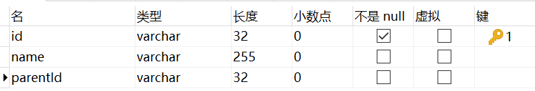
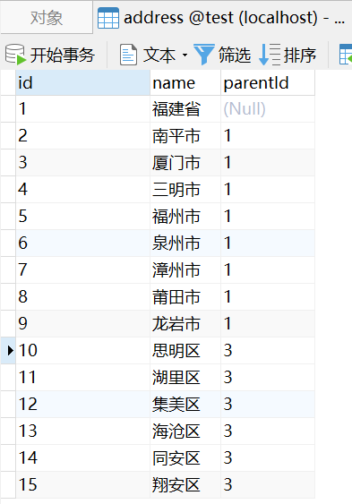
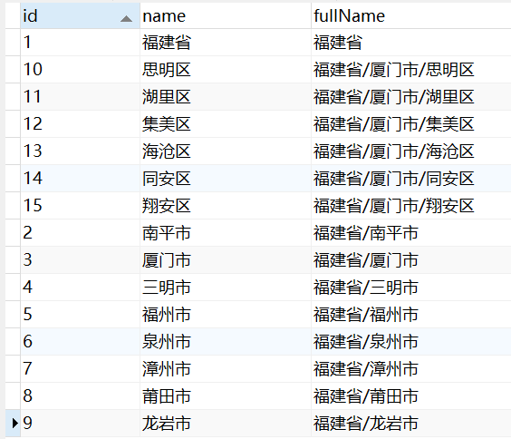

# MySQL层级数据查询

address表结构如下：



address表有如下数据：



现在创建一个函数，获取地址全称：

```mysql
CREATE DEFINER=`root`@`localhost` FUNCTION `getFullName`(`id` varchar(1000)) RETURNS varchar(1000) CHARSET utf8mb4
    READS SQL DATA
BEGIN

	DECLARE fullName VARCHAR(1000);
	DECLARE parentId VARCHAR(1000);
	DECLARE parentName VARCHAR(1000);
	
	set fullName = (SELECT address.`name` FROM address WHERE address.id = id);
	set parentId = (SELECT address.parentId FROM address WHERE address.id = id);
	
	WHILE parentId IS NOT NULL DO
	    set parentName = (SELECT address.`name` FROM address WHERE address.id = parentId);
			set fullName = CONCAT(parentName,"/",fullName);
	    set parentId = (SELECT address.parentId FROM address WHERE address.id = parentId);
    END WHILE;
	
	RETURN fullName;
END
```

函数测试：

```mysql
SELECT
	`address`.`id` AS `id`,
	`address`.`name` AS `name`,
	`getFullName` ( `address`.`id` ) AS `fullName` 
FROM
	`address`
```

