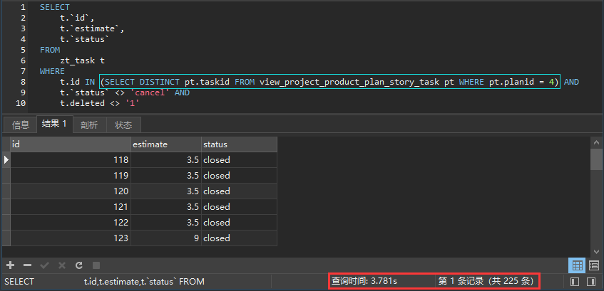
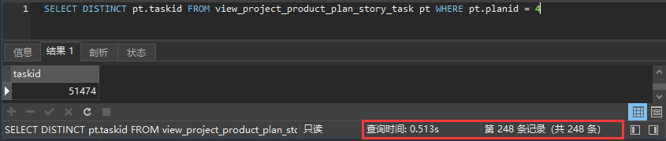

# 子查询与查询效率

### 1. 重复执行子查询 

#### 1.1现象

sql执行情况：



子查询执行情况：



#### 1.2分析

上述sql语句在执行时，子查询会被重复执行，拉低了整个查询的效率。

#### 1.3解决

解决方法：复用子查询查询结果

```java
@Query(" select " +
        "    distinct pt.taskId " +
        "from " +
        "    ProjectProductPlanStoryTaskEntity pt " +
        "where " +
        "    pt.planId = :planId")
Set<Integer> findTaskByProjectId(@Param("planId") Integer planId);

@Query(" select t " +
        "from ZtTask t " +
        "where " +
        "   t.id in (:taskIdSet) and" +
        "   t.deleted <> '1' and " +
        "   t.status <> 'cancel' ")
Set<ZtTask> getValidTask(@Param("taskIdSet") Set<Integer> taskIdSet);


//复用子查询
Set<Integer> taskIds = ptRepository.findTaskByProjectId(4);
Set<ZtTask> ztTasks = repository.getValidTask(taskIds);
```

