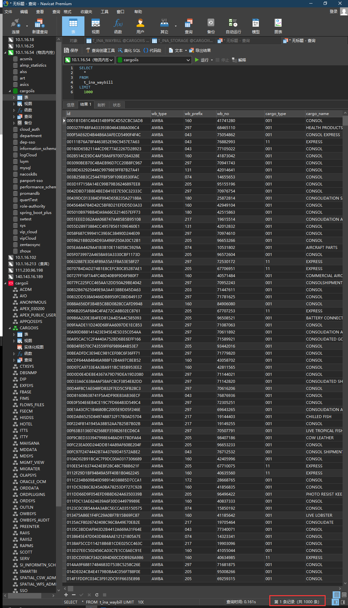
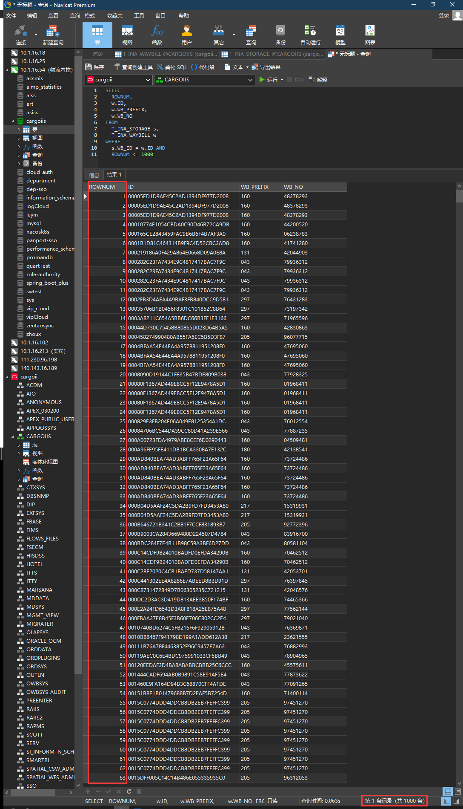

# 限制查询到的数据条数

## 1. MySQL

```sql
select
    ......
from
    ......
where
    ......
limit
    数据条数上限
```



## 2. Oracle

```sql
select
    rownum,
    ......
from
    ......
where
    ...... and
    rownum <= 数据条数上限
```

